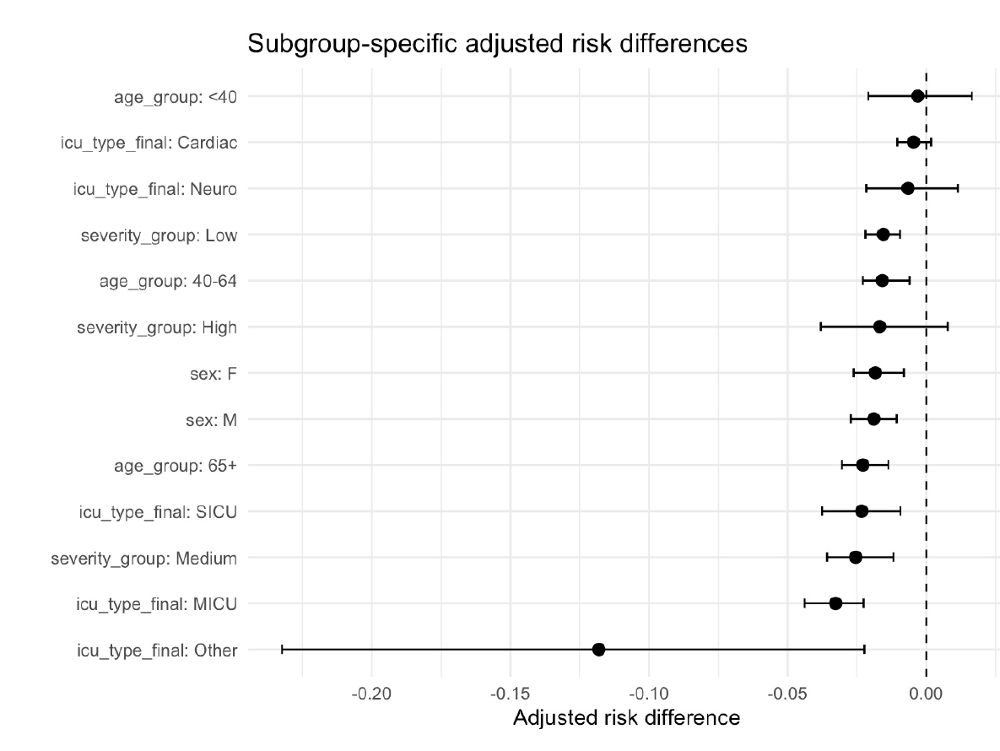

# Effect Heterogeneity of Obesity on ICU Mortality

This project investigates whether the relationship between obesity and in-hospital mortality varies across ICU patient subgroups using the **MIMIC-IV** database.

The analysis applies causal inference methods to estimate subgroup-specific effects across **age, sex, illness severity, and ICU type**.

## Project Overview

Obesity is generally associated with adverse health outcomes, but previous research has documented an **"obesity paradox"** in critically ill populations, where obese patients may exhibit lower mortality risk.

This project examines whether this association is consistent across ICU populations or varies according to patient and clinical characteristics.

## Data

The analysis uses data derived from the **MIMIC-IV** database, a de-identified electronic health record database containing ICU patient information.

After preprocessing, the analytical dataset contains **49,320 ICU stays**:

* 32,070 non-obese patients
* 17,250 obese patients

Obesity is defined as **BMI ≥ 30**, and the primary outcome is in-hospital mortality.

> **Data Availability:** MIMIC-IV is a credentialed-access dataset. Patient-level source data are not distributed through this repository.

## Methodology

The analysis includes:

* Data preprocessing and BMI-based obesity classification
* Logistic regression with interaction terms
* Parametric g-computation
* Subgroup-specific risk difference estimation
* Nonparametric bootstrap inference with **200 resamples**
* 95% confidence interval estimation
* Effect heterogeneity analysis
* Forest plot visualization

Potential confounders included **age, sex, illness severity (SOFA score), and ICU type**.

## Results

The analysis found that obesity was associated with lower adjusted in-hospital mortality across several ICU patient subgroups, although the magnitude of the association varied.

Key patterns included:

* Stronger protective associations among patients aged **65 and older**
* The largest severity-related effect among patients with **moderate illness severity**
* Relatively little effect heterogeneity between males and females
* Variation across ICU types, particularly in the **MICU and SICU**

These results suggest that the obesity paradox may not be uniform across critically ill populations and may depend on patient characteristics and clinical context.

## Visualization



The forest plot displays estimated adjusted risk differences and 95% confidence intervals across patient subgroups.

## Tools & Methods

**R** · **MIMIC-IV** · **Logistic Regression** · **Causal Inference** · **Parametric G-Computation** · **Bootstrap Inference** · **Data Visualization**

## Repository Structure

```text
icu-obesity-causal-inference/
│
├── README.md
├── icu_obesity_analysis.Rmd
└── subgroup_effects.png
```

## Limitations

Because this is an observational study, the analysis relies on assumptions regarding measured confounding and causal identification. Residual confounding may remain, and illness severity at ICU admission may not be strictly pre-treatment.

Some subgroup estimates also have relatively wide confidence intervals due to smaller sample sizes and should therefore be interpreted cautiously.

## Author

**Mian Xie** 
UCLA Statistics & Data Science
